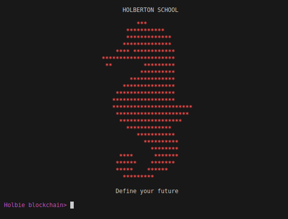
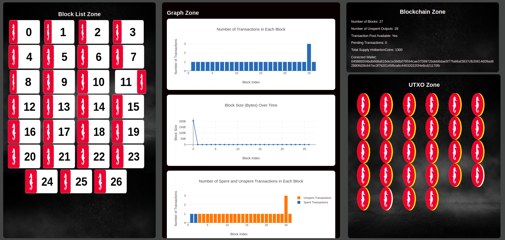

<h1 align="center">Blockchain 👇 Terminal</h1>
<br>
<p align="center">

</p>

<br>

### <h1 align="center">👇Blockchain Graphic Representation👇</h1>
<br>
<p align="center">

</p>

<br>

<h2 align="center"><a href="https://github.com/crasride/blockchain_cli_extension/tree/master/cli"> 👉 Blockchain - CLI - extension</a></h2>


### How to interact with the Blockchain library you previously created

### Requirements

* [OpenSSL](https://www.openssl.org/source/old/index.html) 1.1.1f
* [GCC](https://gcc.gnu.org/) (see [`gcc(1)`](https://www.man7.org/linux/man-pages/man1/gcc.1.html) details)
* [make](https://www.gnu.org/software/make/)

### install [Readline](https://web.mit.edu/gnu/doc/html/rlman_2.html)
```bash
sudo apt update
sudo apt install libreadline-dev
```

### Install the static library

* [llist](./llist/)
```bash
cd llist
sudo ./install.bash
```

* [crypto](./crypto/)
```bash
cd crypto
make libhblk_crypto.a
```

* [blockchain/v0.3](./blockchain/v0.3/)
```bash
cd blockchain/v0.3
make make libhblk_blockchain.a
```

### Build the `cli` executable

* [cli](./cli/)
```bash
cd cli
make cli
```

### Usage

Run the following command from the root of the repository:

```bash
./cli
```

### Available commands in the CLI:

| Command        | Usage                       | Description                                     |
| ---------------| --------------------------- | ----------------------------------------------- |
| help           | `help`                      | Display information about available commands.   |
| wallet_create  | `wallet_create`             | Create a new wallet.                            |
| wallet_save    | `wallet_save <path>`        | Save wallet to a file.                          |
| wallet_load    | `wallet_load <path>`        | Load wallet from a file.                        |
| mine           | `mine`                      | Mine new blocks.                                |
|                | `mine <amount>`             | Amount to mine mining                           |
| send           | `send <amount> <address>  ` | Send coins to a specific address.               |
| info           | `info`                      | Display information about the blockchain.       |
| info_block     | `info_block `               | Display information about the block.            |
| list_utxo      | `list_utxo`                 | List unspent transactions.                      |
| save           | `save <path>/<file>`        | Save blockchain data to a file.                 |
| load           | `load <path>  `             | Load blockchain data from a file.               |
| ls             | `ls`                        | List files in the current directory.            |
| clear          | `clear`                     | Clear the screen.                               |
| ↑ ↓ ← →        | `direction arrows`          | Direction arrows.                               |
| exit           | `exit`                      | Exit.                                           |


### What is the Blockchain CLI Extension?


<details>
<summary>How to maintain a transaction pool</summary>
<br>

</details>


<div align="center">

### Authors

|                                       |                                |
| ------------------------------------------------------- | --------------------------------------------------- |
| You can contact me 📩                                  | You can contact me 📩                               |
| [](https://github.com/guenoel) | [](https://github.com/crasride) |
| <div align="center"><a href="https://twitter.com/GuenoelAndrieux" target="blank"></a><a href="https://www.linkedin.com/in/guenoelandrieux/" target="blank"></a><a href="https://medium.com/@5020" target="blank"></a><a href="https://discord.gg/Guenoel#1989" target="blank"></a></div> | <div align="center"><a href="https://twitter.com/JosFern35900656" target="blank"></a><a href="https://medium.com/@4990" target="blank"></a><a href="https://discord.gg/José Fernandez Armas#7992" target="blank"></a><a href="https://www.linkedin.com/in/jd-fernandez/" target="blank"></a></div> |

</div>


