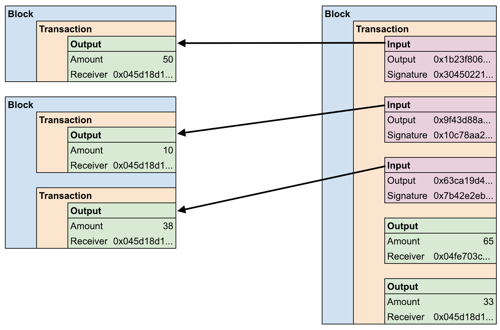
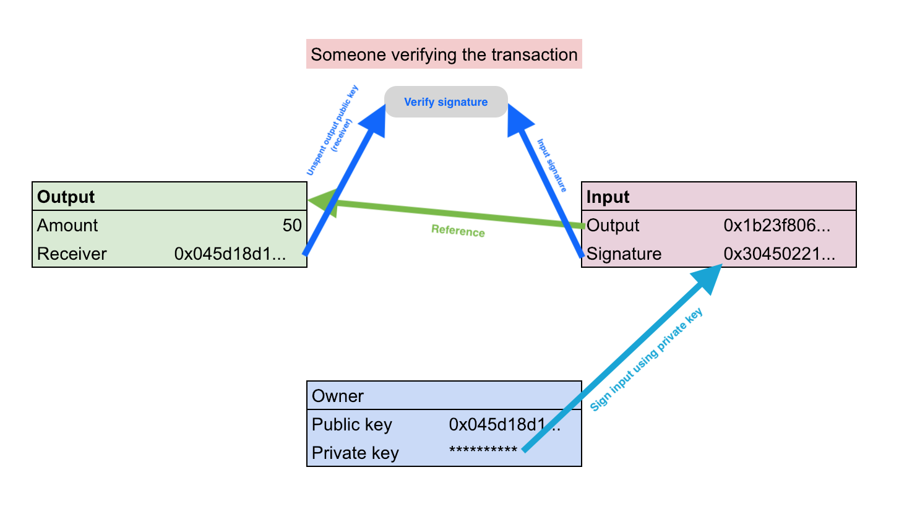

<h1 align="center">[EYNTK] Blockchain - Transactions</h1>

### Introduction
In this project, we are going to introduce the transaction logic to our Blockchain in order to transform it into a simple cryptocurrency.

Note that we are going to implement the [UTXO](https://www.investopedia.com/terms/u/utxo.asp) transaction model. UTXO is used in Bitcoin and other cryptocurrencies.

### Overview
Our Blockchain is not going to store any coin. The only thing stored is a list of transactions. Each transaction will transfer coins from a public key (a.k.a `wallet`) to another.

To find a wallet balance, we compute the total amount of unspent transaction outputs, sent to this public key.

### Inputs and outputs
A transaction consists of two main components: **inputs** and **outputs**.

* **Transaction outputs** specify where (or to whom) coins are sent
* **Transaction inputs** are references to a past transaction output, proving the `sender` owns the coins needed for the transaction

<p align="left">
    
</p>


In this example, the 2 Blocks on the left represent 2 Blocks that were mined in the past. Each Block contains a list of transactions, each transaction contains a list of inputs and a list of outputs. Here we highlight the fact that our user was previously sent a total of 98 coins.

These unspent outputs are going to be used as input for the transaction on the right. Here we are sending `65` coins to a public key, and we send the leftover back to ourselves (`33` coins). In fact, we cannot simply send 65 coins if we don’t have **exactly** 65 coins available. The unspent transaction outputs used as input are immutable. The solution is simply to send the leftover of the transaction back to our own account, and thus transform this leftover into a new unspent output.

### Inputs signature
To ensure authenticity and security, one can not simply reference an unspent transaction output, and use it for a new transaction. This is why transaction inputs need to be digitally signed (using ECDSA) by the owner of the coins (the receiver of the unspent outputs).

A transaction output contains the public key of the receiver, and only the owner of the private key associated with that public key. When an input is created, the owner will sign it, authenticating the transaction. Anyone can then verify the input signature using the referenced output public key.

<p align="left">
    
</p>


Note that all the inputs in a transaction are signed **only after** the transaction itself is validated. The message signed in the input will be the transaction ID itself, ensuring immutability of the whole transaction, once it is validated.

### Coinbase transactions
So when we think about it, every transaction is made by locating unspent outputs and “convert” them into new outputs. But where do the coins come from in the first place? Here come the coinbase transactions.

A coinbase transaction is a specific type of transaction. It doesn’t reference any unspent output, and only output a fixed amount of coin to an address. This will basically add new coins to circulation.

A coinbase transaction is added to a Block before it is being mined. The miner who will try to mine the Block will create this coinbase transaction and output the coins to themselves. Mining a Block is a race, and the first person (miner) to find a suitable hash for a Block will be rewarded by having its coinbase transaction validated. This will give this person new coins to use.

### Data structure
Let’s break down the different data structures we are going to use/update in order to implement the transaction logic in our Blockchain.

### Block
The first data structure we are going to update is the Block structure. Each Block will now store a list of transactions, simply represented by a linked list:
```
/**
 * struct block_s - Block structure
 *
 * @info:         Block info
 * @data:         Block data
 * @transactions: List of transactions
 * @hash:         256-bit digest of the Block, to ensure authenticity
 */
typedef struct block_s
{
    block_info_t    info; /* This must stay first */
    block_data_t    data; /* This must stay second */
    llist_t     *transactions;
    uint8_t     hash[SHA256_DIGEST_LENGTH];
} block_t;
```
### Transaction
Each transaction in a Block is a pointer to the following data structure:

```/**
 * struct transaction_s - Transaction structure
 *
 * @id:      Transaction ID. A hash of all the inputs and outputs.
 *           Prevents further alteration of the transaction.
 * @inputs:  List of `tx_in_t *`. Transaction inputs
 * @outputs: List of `tx_out_t *`. Transaction outputs
 */
typedef struct transaction_s
{
    uint8_t     id[SHA256_DIGEST_LENGTH];
    llist_t     *inputs;
    llist_t     *outputs;
} transaction_t;
```

This structure is pretty self explanatory. It contains two linked lists, one for the inputs and one for the outputs. The **transaction ID** (or transaction hash) has the same purpose as a Block hash. It ensures the immutability of the data contained in the transaction.

### Transaction outputs
Each output in a transaction is a pointer to the following data structure:

```
/**
 * struct tx_out_s - Transaction output
 *
 * @amount: Amount received
 * @pub:    Receiver's public address
 * @hash:   Hash of @amount and @pub. Serves as output ID
 */
typedef struct tx_out_s
{
    uint32_t    amount;
    uint8_t     pub[EC_PUB_LEN];
    uint8_t     hash[SHA256_DIGEST_LENGTH];
} tx_out_t;
```
A transaction output consists of “sending `amount` coins to the address `pub`”. The `hash` is use to ensure immutability of the data, and it serves as the output ID.

To be noted that in our implementation, we will only use integer numbers as amounts.

### Transaction inputs
Each input in a transaction is a pointer to the following data structure:

```
/**
 * struct tx_in_s - Transaction input
 *
 * Description: A transaction input always refers to a previous
 * transaction output. The only exception is for a Coinbase transaction, that
 * adds new coins to ciruclation.
 *
 * @block_hash:  Hash of the Block containing the transaction @tx_id
 * @tx_id:       ID of the transaction containing @tx_out_hash
 * @tx_out_hash: Hash of the referenced transaction output
 * @sig:         Signature. Prevents anyone from altering the content of the
 *               transaction. The transaction input is signed by the receiver
 *               of the referenced transaction output, using their private key
 */
typedef struct tx_in_s
{
    uint8_t     block_hash[SHA256_DIGEST_LENGTH];
    uint8_t     tx_id[SHA256_DIGEST_LENGTH];
    uint8_t     tx_out_hash[SHA256_DIGEST_LENGTH];
    sign_t       sig;
} tx_in_t;
```

A transaction input will store all the information needed to locate the referenced transaction output, along with a signature.

### Unspent transaction output
Keeping track of unspent transactions can become really time consuming as our Blockchain grows. A simple solution to that is to keep track of them in a linked list.

When a transaction is created, all its outputs will be stored in a list of unspent outputs. Once an unspent output is referenced in a new transaction input, it will be removed from the list.

```
/**
 * struct unspent_tx_out_s - Unspent transaction output
 *
 * Description: This structure helps identify transaction outputs that were not
 * used in any transaction input yet, making them "available".
 *
 * @block_hash: Hash of the Block containing the transaction @tx_id
 * @tx_id:      ID of the transaction containing @out
 * @out:        Copy of the referenced transaction output
 */
typedef struct unspent_tx_out_s
{
    uint8_t     block_hash[SHA256_DIGEST_LENGTH];
    uint8_t     tx_id[SHA256_DIGEST_LENGTH];
    tx_out_t    out;
} unspent_tx_out_t;
```
Note that the `out` element of this structure is a **copy** of the referenced transaction output.

### Blockchain
Our Blockchain will now store the list of all the unspent transaction outputs:

```
/**
 * struct blockchain_s - Blockchain structure
 *
 * @chain:   Linked list of Blocks
 * @unspent: Linked list of unspent transaction outputs
 */
typedef struct blockchain_s
{
    llist_t     *chain;
    llist_t     *unspent;
} blockchain_t;
```

### Coinbase
As said earlier, a coinbase transaction will always output a **fixed** amount of coins. This amount is defined in our codebase by the following macro:

```
# define COINBASE_AMOUNT    50
```

### Block hash
With the introductions of a list of transactions in the Block structure, we need to update the way we compute the hash of such Block to include this list of transactions, and guaranty immutability.

* Information to hash:
    * **4** bytes -> `info.index`
    * **4** bytes -> `info.difficulty`
    * **8** bytes -> `info.nonce`
    * **8** bytes -> `info.timestamp`
    * **32** bytes -> `info.prev_hash`
    * `data.len` bytes -> `data.buffer`
    * For each transaction `t` of `transactions`:
        * **32** bytes -> `t.id`

Here, you can see that we only need to take each transaction’s `id` into account in our hash. In fact, this transaction ID is already a hash of all the information contained in a transaction.

### Conclusion

* Each Block in our Blockchain will now store a list of Transactions.
* A transaction consists of a list of inputs (where the coins come from), and a list of outputs (where the coins are going).
* Transaction inputs are signed by the owner of the coins to be sent, ensuring authenticity.
* Coinbase transactions are created to introduce new coins to circulation. They serve a reward to the miners.
* We keep track of all the unspent transaction outputs in our Blockchain, to facilitate creation of new inputs.
